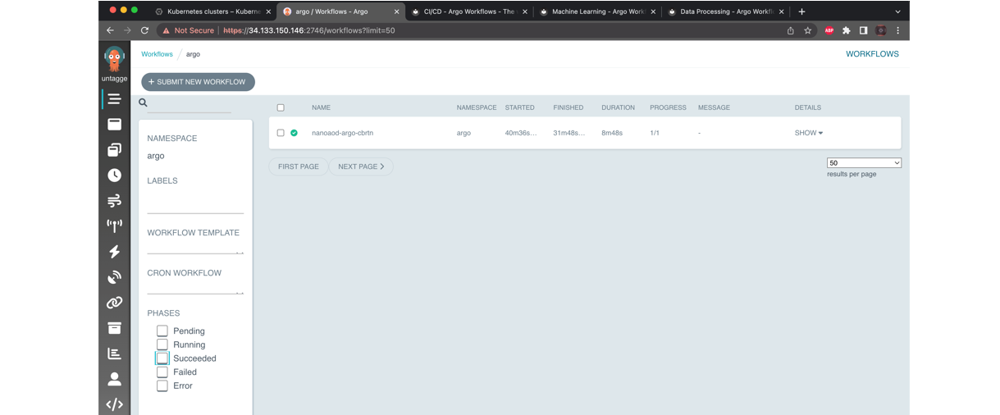

## Accessing files via http

With the storage pod, you can copy files between the storage element and the
CloudConsole. However, a practical use case would be to run the "big data"
workloads in the cloud, and then download the output to your local desktop or
laptop for further processing. An easy way of making your files available to
the outside world is to deploy a webserver that mounts the storage volume.

We first patch the config of the webserver to be created as follows:

```bash
mkdir conf.d
cd conf.d
curl -sLO https://raw.githubusercontent.com/cms-opendata-workshop/workshop-payload-kubernetes/master/conf.d/nginx-basic.conf
cd ..
kubectl create configmap basic-config --from-file=conf.d -n argo
```

Then prepare to deploy the fileserver by downloading the manifest:

```bash
curl -sLO https://github.com/cms-opendata-workshop/workshop-payload-kubernetes/raw/master/deployment-http-fileserver.yaml
```

Open this file and again adjust the `<NUMBER>`:

```yaml
# deployment-http-fileserver.yaml
apiVersion: apps/v1
kind: Deployment
metadata:
  labels:
    service: http-fileserver
  name: http-fileserver
spec:
  replicas: 1
  strategy: {}
  selector:
    matchLabels:
      service: http-fileserver
  template:
    metadata:
      labels:
        service: http-fileserver
    spec:
      volumes:
      - name: volume-output
        persistentVolumeClaim:
          claimName: nfs-<NUMBER>
      - name: basic-config
        configMap:
          name: basic-config
      containers:
      - name: file-storage-container
        image: nginx
        ports:
        - containerPort: 80
        volumeMounts:
          - mountPath: "/usr/share/nginx/html"
            name: volume-output
          - name: basic-config
            mountPath: /etc/nginx/conf.d
```

Apply and expose the port as a `LoadBalancer`:

```bash
kubectl create -n argo -f deployment-http-fileserver.yaml
kubectl expose deployment http-fileserver -n argo --type LoadBalancer --port 80 --target-port 80
```

Exposing the deployment will take a few minutes. Run the following command to
follow its status:

```bash
kubectl get svc -n argo
```

You will initially see a line like this:

~~~
NAME                          TYPE           CLUSTER-IP   EXTERNAL-IP   PORT(S)        AGE
http-fileserver               LoadBalancer   10.8.7.24    <pending>     80:30539/TCP   5s
~~~
{: .output}

Wait a couple minutes recheck the previous command, copy your EXTERNAL-IP and paste it on a new tab, it should look something like this:


The `<pending>` `EXTERNAL-IP` will update after a few minutes (run the command
again to check). Once it's there, copy the IP and paste it into a new browser
tab. This should welcome you with a "Hello from NFS" message. In order to
enable file browsing, we need to delete the `index.html` file in the pod.
Determine the pod name using the first command listed below and adjust the
second command accordingly.


```bash
kubectl get pods -n argo
kubectl exec http-fileserver-XXXXXXXX-YYYYY -n argo -- rm /usr/share/nginx/html/index.html
```

> ## Warning: anyone can now access these files
>
> This IP is now accessible from anywhere in the world, and therefore also
> your files (mind: there are charges for outgoing bandwidth). Please delete
> the service again once you have finished downloading your files.
>
> ```bash
> kubectl delete svc/http-fileserver -n argo
> ```
>
> Run the `kubectl expose deployment` command to expose it again.
>
{: .testimonial}

## Argo GUI

Check the services running and the associated IP addresses:
```bash
kubectl get svc -n argo
kubectl -n argo port-forward deployment/argo-server 2746:2746
```
It will start fowarding port, to not inturrupt this open a new window, after a couple minutes it will be handling connection.
Open in new terminal window and run: 

```bash
lynx https://localhost:2746
```

This will permit that the port is accessed, finally patch the service with:

```bash
kubectl patch svc argo-server -n argo -p '{"spec": {"type": "LoadBalancer"}}'
```

Since it is creating an external ip, wait a couple minutes. You can check if it is ready with:

```bash
kubectl get svc -n argo
```

* Finally, you can access this address in your localhost. Do not forget to add “https://” and “:2746”
* Click on Advanced, proceed to <ip>(unsafe) and voilà
  



